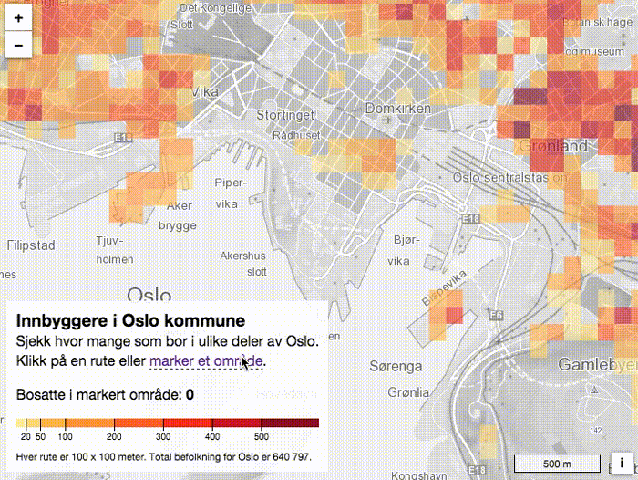

# Befolkningsdata på rutenett

<a href="http://www.ssb.no/">Statistisk sentralbyrå (SSB)</a> har <a href="http://data.ssb.no/api/">en rekke statistikker</a> som egner seg til visning på kart. Det vanligste er å koble statistikk til fylker, kommuner eller <a href="http://kartverket.no/Kart/Kartdata/Grenser/Produktark-for-grunnkretser/">grunnkretser</a> - som er den minste statistiske inndelingen i Norge. Hvordan du kan koble statistikk til administrative enheter eller grunnkretser er forklart i <a href="https://github.com/GeoForum/veiledning02">veiledning 2</a>. Her skal vi derimot se på annen type visualisering på kart; statistikk på rutenett. 

Bildet over viser kartet vi skal lage. Vi skal legge befolkningsdata i ruter på 100 x 100 m oppå bakgrunnskart fra Kartverket. Brukeren kan selv markere et område for å se antall innbyggere. I Oslo har det vært stor diskusjon rundt bilfritt sentrum, og med dette kartet kan du selv se hvor mange personer som bor i de berørte områdene. <a href="http://geoforum.github.io/veiledning08/">Klikk her for å gå til det ferdige kartet</a>.

